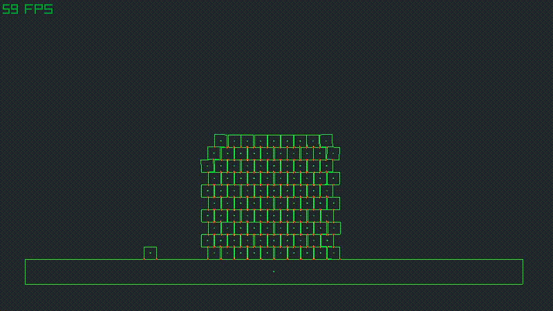

# Box2D-Lite Zig
Version of [Box2D-Lite](https://github.com/erincatto/box2d-lite) rewritten in
the [Zig programming language](https://ziglang.org/)

> Box2D-Lite is a small 2D physics engine. It was developed for the 2006 GDC Physics Tutorial. This is the original version of the larger Box2D library. The Lite version is more suitable for learning about game physics.

### Note: it's still work-in-progress!

Tested Zig compiler version: **0.10.0-dev.2585+fcfeafe99**



[box2d_raylib_debugdraw.zig](box2d_raylib_debugdraw.zig): Debug drawing with raylib.

## Basic Example
Shows how to set-up a physics world and run simulation. Prints body positions to console.
```zig
const std = @import("std");
const b2 = @import("box2d.zig");

pub fn main() anyerror!void {
    // Initialize Box2D World
    var b2World: b2.World = b2.World{
        .gravity = b2.Vec2{ .x = 0, .y = -9.81 },
        .iterations = 6,
        .accumulateImpulses = true, // Enable accumulating impulsed over many frames
        .warmStarting = true, // Reuse impulses from last frame to start the physics solver
        .positionCorrection = true, // Also correct position, not just velocity
        .bodies = std.ArrayList(b2.Body).init(std.heap.page_allocator),
        .arbiters = b2.World.ArbiterMap.init(std.heap.page_allocator),
    };

    // Add ground
    // Body.init arguments: position, scale, mass
    b2World.addBody(b2.Body.init(.{ .x = 0, .y = 0 }, .{ .x = 20, .y = 1 }, std.math.inf(f32)));
    // Add dynamic body
    b2World.addBody(b2.Body.init(.{ .x = 0, .y = 5 }, .{ .x = 2, .y = 2 }, 2.0));
    
    while(true) {
        // Simulate physics
        b2World.step(deltatime);
        // Print positions of bodies
        for (b2World.bodies.items) |b, i| std.debug.print("Body #{} position={}\n", .{i, b.position});
    }
}
```

## TODO
- joints
- proper example app
